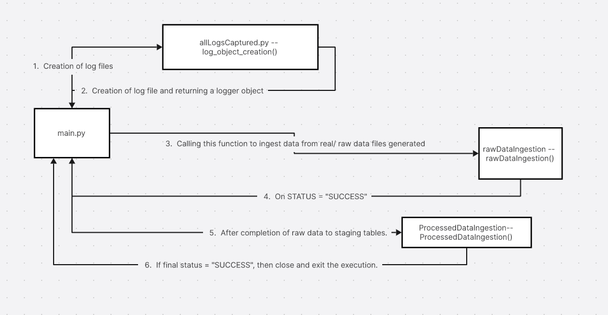

# Data Engineering Case Study

Imagine you are a data engineer working for AdvertiseX, a digital advertising technology company. AdvertiseX specializes in programmatic advertising and manages multiple online advertising campaigns for its clients. The company handles vast amounts of data generated by ad impressions, clicks, conversions, and more. Your role as a data engineer is to address the following challenges:

## Data Sources and Formats:

### Ad Impressions:
Data Source: AdvertiseX serves digital ads to various online platforms and websites.
Data Format: Ad impressions data is generated in JSON format, containing information such as ad creative ID, user ID, timestamp, and the website where the ad was displayed.

### Clicks and Conversions:
Data Source: AdvertiseX tracks user interactions with ads, including clicks and conversions (e.g., sign-ups, purchases).
Data Format: Click and conversion data is logged in CSV format and includes event timestamps, user IDs, ad campaign IDs, and conversion type.

### Bid Requests:
Data Source: AdvertiseX participates in real-time bidding (RTB) auctions to serve ads to users.
Data Format: Bid request data is received in a semi-structured format, mostly in Avro, and includes user information, auction details, and ad targeting criteria.

## Case Study Requirements:

### Data Ingestion:
Implement a scalable data ingestion system capable of collecting and processing ad impressions (JSON), clicks/conversions (CSV), and bid requests (Avro) data.
Ensure that the ingestion system can handle high data volumes generated in real-time and batch modes.

### Data Processing:
Develop data transformation processes to standardize and enrich the data. Handle data validation, filtering, and deduplication.
Implement logic to correlate ad impressions with clicks and conversions to provide meaningful insights.

### Data Storage and Query Performance:
Select an appropriate data storage solution for storing processed data efficiently, enabling fast querying for campaign performance analysis.
Optimize the storage system for analytical queries and aggregations of ad campaign data.

### Error Handling and Monitoring:
Create an error handling and monitoring system to detect data anomalies, discrepancies, or delays.
Implement alerting mechanisms to address data quality issues in real-time, ensuring that discrepancies are resolved promptly to maintain ad campaign effectiveness.

This Ad Tech case study scenario focuses on the challenges and data formats commonly encountered in the digital advertising industry. Candidates can use this information to design a data engineering solution that addresses the specific data processing and analysis needs of AdvertiseX.


## Solution and the explanation:

Firstly create a new virtual environment and run the following command inside the folder where you want to clone the project:

```python
$python3 -m venv EnvName
```

Now activate the virtual environment created

```python
$EnvName\Scripts\activate
```

Now clone the git repo:

```
$  git clone https://github.com/Prateekjha09/DataEngineeringCaseStudy.git
```

The folder structuring will look something like this:


<b>logGeneration:</b> 
This folder will contain logs which will be generated for our scheduled data pipeline and a new file will be generated everyday for the same.

<b>privateKey:</b>
This folder has contents:
a. Config which further contains "config.ini" ( responsible for storing database level configuration values which need to be kept hidden for security purposes)
b. rsa_key.p8 ( contains key which will be used to connect to snowflake DB programmatically.)

<b>SQL_Scripts</b>
This folder consists of 
1. tablesCreation.sql 
This script can be used directly to create tables in the desired database in the required schema.

2. StagingToPRODMovement.sql
This script contains stored procedure and task creation script which is to be run only once and has to be called every time upon data ingestion from staging to final serving layer.

1. allLogsCaptured.py -- capturing and initialization of log files and it's relevant object created which is to be used in entire code via function calls.

2. connection.py -- contains functions for opening and closing connections to databases based on decided configuration.

3. rawDataIngestion.py -- contains logic for fetching raw data from original sources and storing it in snowflake DB

4. ProcessedDataIngestion.py -- consists of a simple snowflake task being triggered on an ad hoc basis, which in turn contains a stored procedure which runs "MERGE" statements between staging and final tables which insert and update data accordingly

<b>requirements.txt</b>
This file contains list of libraries to be used for smooth running of this data pipeline.

<b>main.py</b> 
The triggering point from where the execution of the entire code starts.

### Flow of code


Finally this data can be used for further analysis or cater different needs for different teams based on who has what access to this data.

I hope this helps everyone out there!
Cheers


## Contributors
- Prateek Jha


